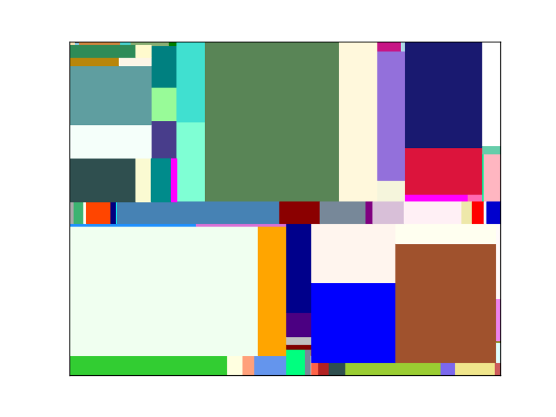
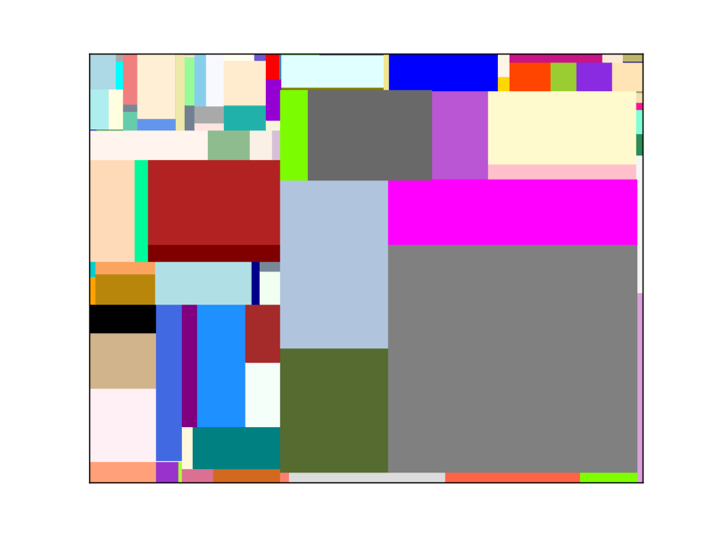

# Mondrian art

Generate "modern art" using [Mondrian Processes](https://en.wikipedia.org/wiki/Piet_Mondrian#Paris_.281911.E2.80.931914.29), from Python.

## Installation
It requires [Python 3](https://docs.python.org/3/), and can be installed from [Pypi](https://pypi.python.org/pypi/mondrian-art/) with [`pip`](https://pip.pypa.io/):
```
pip3 install mondrian-art
```

> [](https://pypi.python.org/pypi/mondrian-art/)
[](https://pypi.python.org/pypi/mondrian-art/)

## Usage
From Python, use the fonction `generate` (with default options, or use custom options, see the source for more information):
```python
from mondrian_art import generate
plt = generate()
plt.show()
```

You can also execute the [`mondrian_art.py`](https://github.com/MechCoder/mondrian-art/blob/master/mondrian_art/mondrian_art.py) script:

```bash
python3 mondrian_art/mondrian_art.py
```

## Sample images

  

## About
### Reference
Section 1 in [arXiv:1507.05181](https://arxiv.org/pdf/1507.05181.pdf).

### Contributors [](https://GitHub.com/MechCoder/mondrian-art/graphs/contributors/)
1. [Manoj Kumar (MechCoder)](https://github.com/MechCoder/)
2. [Lilian Besson (Naereen)](https://github.com/Naereen/)

[](https://GitHub.com/MechCoder/mondrian-art/graphs/commit-activity)
[](https://www.python.org/)

### License [](https://pypi.python.org/pypi/mondrian-art/)

> [BSD 3](https://github.com/MechCoder/mondrian-art/blob/master/LICENSE.txt)
